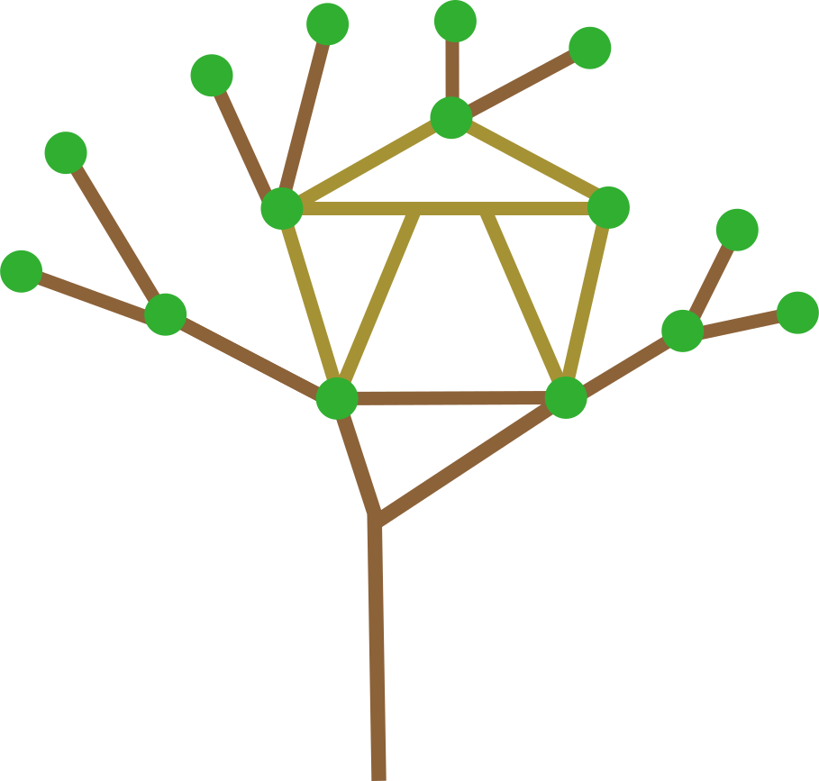

# treehouze

[](https://github.com/wikibonsai/wikibonsai)
[](https://npmjs.org/package/treehouze)

<div style="width:100%; display: flex; justify-content: center;">
  
</div>

Treehouze is a single graph instance that may be translated between [2D](https://github.com/vasturiano/force-graph), [3D](https://github.com/vasturiano/3d-force-graph), [VR](https://github.com/vasturiano/3d-force-graph-vr), and [AR](https://github.com/vasturiano/3d-force-graph-ar) representations without any changes to its shape or structure.

It's designed to be as general-purpose as possible, but was built with [`[[wikirefs]]`](https://github.com/wikibonsai/wikirefs) and [semantic trees](https://github.com/wikibonsai/semtree) structures in mind with the aim of facilitating tangible digital [memory palaces](https://artofmemory.com/blog/how-to-build-a-memory-palace/).

🏡 Build and maintain a treehouze to play in in your [WikiBonsai](https://github.com/wikibonsai/wikibonsai) digital garden.

## Install

Install with [npm](https://docs.npmjs.com/cli/v9/commands/npm-install):

```
npm install treehouze
```

Or use a script tag:

```html
<script type="module" src="//unpkg.com/treehouze"></script>
```

## Use

Add 2 div elements to your `html` -- one for the graph itself and another for the element that wraps it (this is for [selecting multiple nodes](#shift--click) to work)

```html
<!DOCTYPE html>
<head>
  <!-- ... -->
</head>
<body>
  <div id="graph-view">
    <div id="graph"></div>
  </div>
</body>
</html>
```

```js
import { TreeHouze } from 'treehouze';

// get graph's html elements
let elementWrap = document.getElementById('graph-view');
let elementGraph = document.getElementById('graph');
// create graph instance
let graph = new TreeHouze(elementWrap, elementGraph, opts);
// set options
let opts = {
  nodestate: (node) => return node.state,
  // some defaults listed below
  ctrls: { enabled: true },
  nodekinds: {
    'doc': '#3e5c50',
    'template': '#F8F0E3',
    'zombie': '#00000000',
  },
  nodetypes: {
    'default': "#31AF31",
  }
};
// create data payload
let data = {
  'nodes': [
    {
      id: '12345',        // used for linking nodes
      label: 'label-txt', // used to label nodes
      kind: 'nodekind',   // used to colorize nodes and for filtering
      type: 'nodetype',   // used to colorize nodes
      state: 0,           // used to calculate glow strength ('ctx.shadowBlur')
    },
    // ...
  ],
  'links': [
    {
      kind: 'linkkind',  // used for filtering
      source: '12345',   // should be a node id
      target: '67890',   // should be a node id
    },
    // ...
  ],
};
// draw graph
graph.draw(data, opts);
```

## API

### `data`

Graph data -- should contain `nodes` and `links`:

#### `nodes`

```json
{
  "id": "12345",        // used for linking nodes
  "label": "label-txt", // used to label nodes
  "kind": "nodekind",   // used to colorize nodes and for filtering
  "type": "nodetype",   // used to colorize nodes
  "state": 0,           // used to calculate glow strength ('ctx.shadowBlur')
  // (web-only)
  "neighbors": {        // used to highlight neighboring nodes
    "nodes": [],        // array of neighbor node ids
    "links": [],        // array of neighbor links
  },
  // (tree-only)
  "lineage": {          // used to highlight lineage nodes
    "nodes": [],        // array of lineage node ids
    "links": [],        // array of lineage links
  },
},
```

#### `links`

```json
{
  "kind": "linkkind",  // used for filtering
  "source": "12345",   // should be a node id
  "target": "6789",    // should be a node id
},
```

#### `draw([data][, opts])`

Draw the graph from the given `data`. If redrawing the graph, `data` may be empty. `opts` may be used to reset any graph options.

### Options

#### `centerSpeed: number`

Speed at which to center nodes (3D-only).

Default is `1000`.

#### `colors: { string: string }`

Hash of graph object names to color hexes.

Defaults:

```json
{
// graph
"background": "#000011",
// node
"text"      : "#e6e1e8", // node labels
"band"      : "#44434d", // node band
"current"   : "#F0C61F", // 'current node'
// link
"link"      : "#44434d",
"particle"  : "#959396", // link particles
}
```

#### `current(node): boolean`

A function that should return if a given node is the 'current' node. The current node will glow a specific color, to distinguish it from its type.

Default is:
```js
(node) => { return false; }
```

#### `dagHeight: number`

A number value to set the height of each level in the tree graph.

Default is `100`.

#### `nodekinds: { string: string }`

A record that maps `nodekind` name strings to hex color strings; value can be a string or a function that returns a string.

Defaults are:

```json
{
  "doc"     : "#3e5c50",
  "template": "#F8F0E3",
  "zombie"  : "#959DA5",
}
```

#### `nodetypes: { string: string }`

A record that maps `nodetype` name strings to hex color strings; value can be a string or a function that returns a string.

Default is:

```json
{
  "default": "#3e5c50"
}
```

#### `ctrls`

Options for graph controls.

All boolean `ctrls` default to `true`.

##### `ctrls.autosync: boolean`

Set auto-sync to on/off.

##### `ctrls.click: boolean`

Set default node clickability to on/off.

##### `ctrls.dim: '2d' | '3d' | 'vr' | 'ar'`

What `dim`ension to render the graph in. Can be: `2d`, `3d`, `vr`, or `ar` (See `DimEnum` for details).

Default is `2d`.

##### `ctrls.drag: boolean`

Set default node draggability to on/off.

##### `ctrls.enabled: boolean`

Enable or disable graph controls.

##### `ctrls.exclude: string[]`

Which controls to exclude. Can be: `kind`, `dim`, `filter`, `fix`, `flip`, `follow`, `glow`, `autosync`, `click`, `drag`, `hover`, `save`, `sync`, `data`. (See `CtrlEnum` for details).

Default is an empty array.

##### `ctrls.filter: { nodes: }`

An object with `nodes` and `links` keys that point to arrays of string values from `doc`, `template`, and `zombie` (see `NodeKindEnum`) and `fam` for the tree graph and `attr`, `link`, `embed` for the web graph (see `LinkKindEnum`).

##### `ctrls.fix: boolean`

Set default of fixed (sticky) nodes (as opposed to force (free-floating)) to on/off.

##### `ctrls.follow: boolean`

Set default of active node following to on/off.

##### `ctrls.hover: boolean`

Set default node hoverability to on/off.

##### `ctrls.glow: boolean`

Set default glow to on/off.

##### `ctrls.kind: 'tree' | 'web'`

Which kind  of graph to draw. Can be: `'tree'` or `'web'` (can access via `GraphKindEnum` for details).

Default is `web`.

### Overridable Methods

The following methods provide default behavior for interacting with the graph. They may be overriden by subclassing the graph and provding your own implementation and/or calling `super.<method>()`.

#### Graph Actions

#### `onClickNode(node, event)`

Centers the node in the graph. If `shift` is also pressed, then the node is added to `selectedNodes`.

#### `onDragNode(node, translate)`

Drags node along cursor path.

#### `onDragEndNode(node)`

Ends dragging a node. The node will stay in place if [`fix`](#ctrlsfix-boolean) is set to `true.

#### `onHoverNode(node, prevNode)`

Highlights the hovered node and either its `neighbors` in the `web` graph or its `lineage` in the `tree` graph. All links connecting these nodes will highlight.

#### `onHoverLink(link)`

Highlights the hovered link and the two nodes it connects to.

#### `onSelectStart(evt)`

Begin box selection of multiple nodes.

#### `onSelect(evt)`

Selecting multiple nodes via box selection.

#### `onSelectEnd(evt)`

End selecting multiple nodes via box selection.

#### Graph Properties

#### `autosync(data)`

Redraws the graph from the given data. This method is unused internally and is meant for auto-syncing with whatever system is managing this graph instance.

#### `save()`

Returns the internal `dataCache`.

This method is recommended to be overriden: It is useful for saving the graph data. It is called when the user clicks the `save` data button.

#### `sync()`

Redraws the graph from the internal `dataCache`.

This method is recommended to be overriden: It is useful for syncing the graph data between some other source and itself. It is called when the user clicks the `sync` button and is meant for auto-sync-ing if implemented downstream.

#### force-graph

As a sidenote, this project showcases a unified instance of [@vasturiano's](https://github.com/vasturiano) force-graph libraries ([2D](https://github.com/vasturiano/force-graph), [3D](https://github.com/vasturiano/3d-force-graph), [VR](https://github.com/vasturiano/3d-force-graph-vr), [AR](https://github.com/vasturiano/3d-force-graph-ar)).
